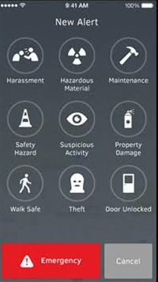
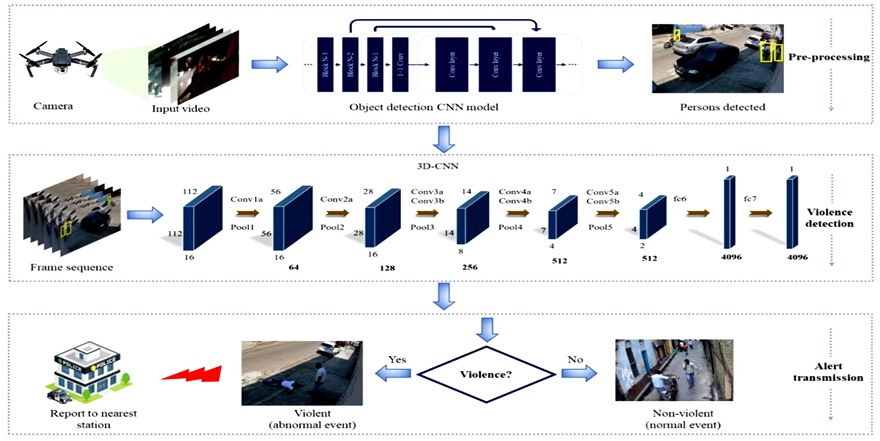
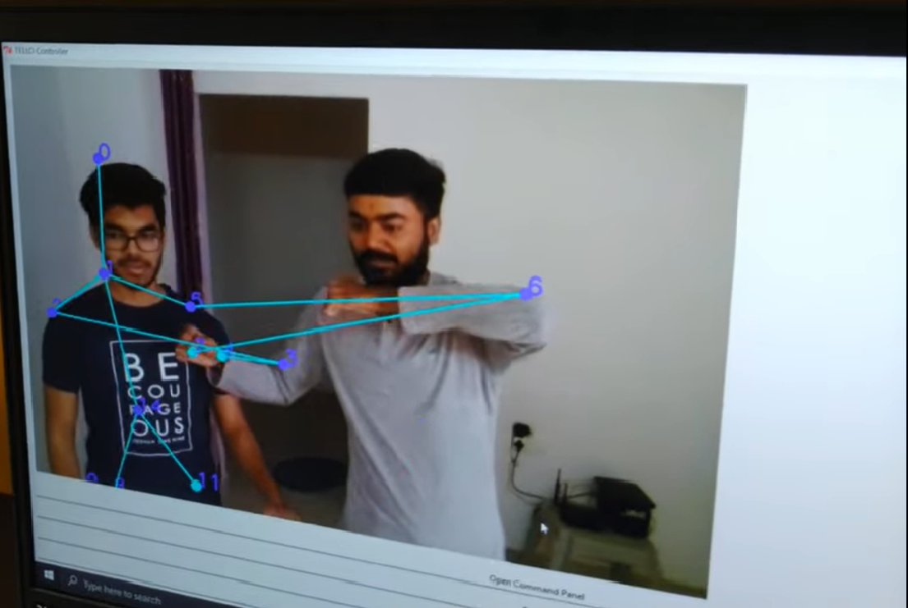

# Bhopal Smart City Hackathon 2.0

# Idea !!!

We want to build an IoT network of connected drones and patrolling vehicles for better surveillance and security.

# How ??

A drone can be attached to a dial-100 vehicle and can be deployed and controlled remotely. A drone can reach any potential or actual crime scene much faster than possible for authorities to reach. On reaching the scene it can transmit the video feed to its nearest dial-100 vehicles and to the control room. The microcontrollers or a raspberry pie board will contain pre-trained AI/Ml models and can run inference on them in real-time. The model will be of pose detection and image segmentation which can detect the danger level of a situation. For example, it can detect a person pointing a gun at someone and conclude the danger level to be High. The onboard device will have three levels of dangers: low, moderate and High. If the detected danger level of the situation is high the device sends an alert to all dial-100 vehicles in a certain radius say 20 Km and it can also alert the control room.  

# Why ???

Everybody wants peace and secure environment to live.So a surveillance system is required to achieve this goal.With increasing crimes and criminals it has become a must need to have such a surveillance system which can help the people right at the time and place of the crime.The technologies like Internet of Things (IOT) and artificial intelligence can lead to such results.So implementing the idea proposed will definitely help the security agencies and police to reduce the graph of crime along with much efficient use of technology.It will not only save the time but also the resources from being wasted.

# Future Scope

The surveillance system will not be limited to local regions but can also be implemented at a higher level at a broader level.The system can be used to check the activities dangerous for the states and country which will automatically reduce criminal activities and increase peace.

